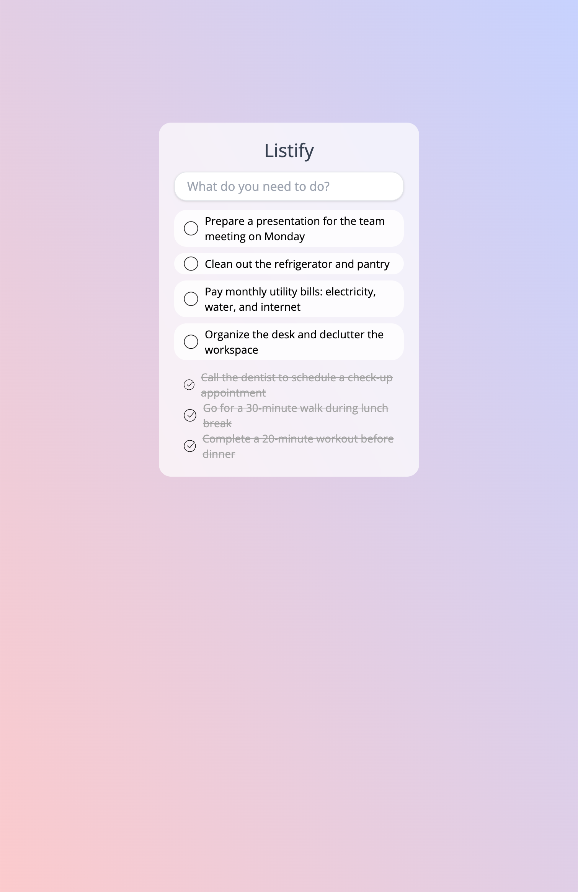

# Listify- To Do list app

Listify: A Minimalist & Elegant To-Do List App
Made in Vue 3 with Vitest for Unit testing.


## Project Setup

```sh
npm install
```

### Compile and Hot-Reload for Development

```sh
npm run dev
```

### Compile and Minify for Production

```sh
npm run build
```

### Run Unit Tests with [Vitest](https://vitest.dev/)

```sh
npm run test:unit
```

### Lint with [ESLint](https://eslint.org/)

```sh
npm run lint
```
